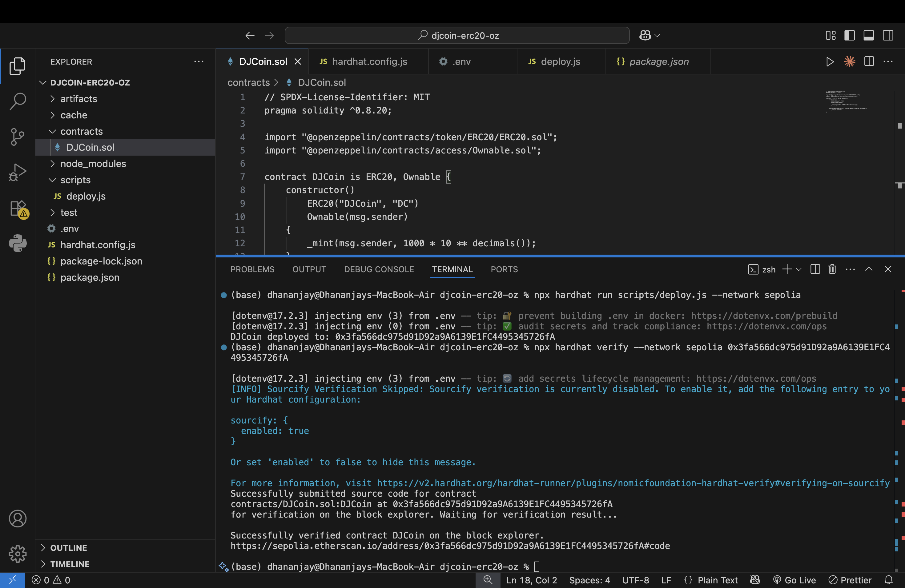

## DJCoin (ERC-20)

DJCoin is a production-grade ERC-20 token built using OpenZeppelin’s audited
contract library and deployed on the Ethereum Sepolia testnet. The project
demonstrates correct usage of industry-standard tooling and security practices
for ERC-20 token development.

### Token Details
- Name: DJCoin
- Symbol: DC
- Decimals: 18
- Token Standard: ERC-20
- Network: Ethereum Sepolia

### Supply & Minting
- Initial Supply: 1000 DC (minted at deployment)
- Minting Mechanism: Owner-controlled mint function
- Supply Logic: Implemented using OpenZeppelin’s `_mint` function
- Ownership: Managed via OpenZeppelin `Ownable`

### Architecture & Security
- Core ERC-20 logic inherited directly from OpenZeppelin (no modification)
- Balance tracking, allowance management, and event emission handled by OZ
- Custom logic limited to deployment configuration and controlled minting
- Follows industry best practices by extending audited contracts rather than
  re-implementing token internals

### Tooling & Workflow
- Language: Solidity
- Framework: Hardhat
- Libraries: OpenZeppelin Contracts
- RPC Provider: Infura
- Deployment Network: Sepolia Testnet
- Contract Verification: Verified on Etherscan

### Deployment
- Contract Address: 0x3fa566dc975d91D92a9A6139E1FC4495345726fA
- Status: Successfully deployed and verified

🔗 Etherscan (Sepolia):  
https://sepolia.etherscan.io/address/0x3fa566dc975d91D92a9A6139E1FC4495345726fA

### Deployment & Verification Proof

The following screenshot shows the successful deployment of DJCoin on the
Ethereum Sepolia testnet using Hardhat, followed by successful contract
verification on Etherscan.

